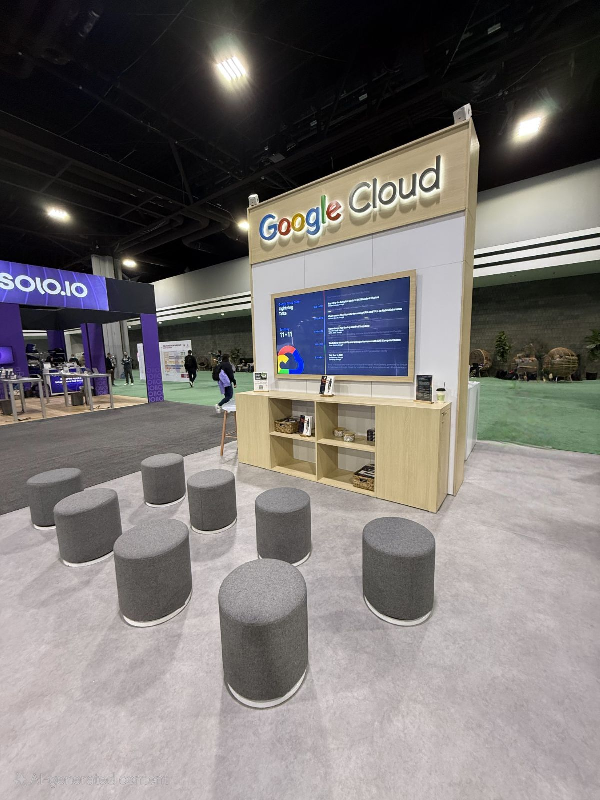
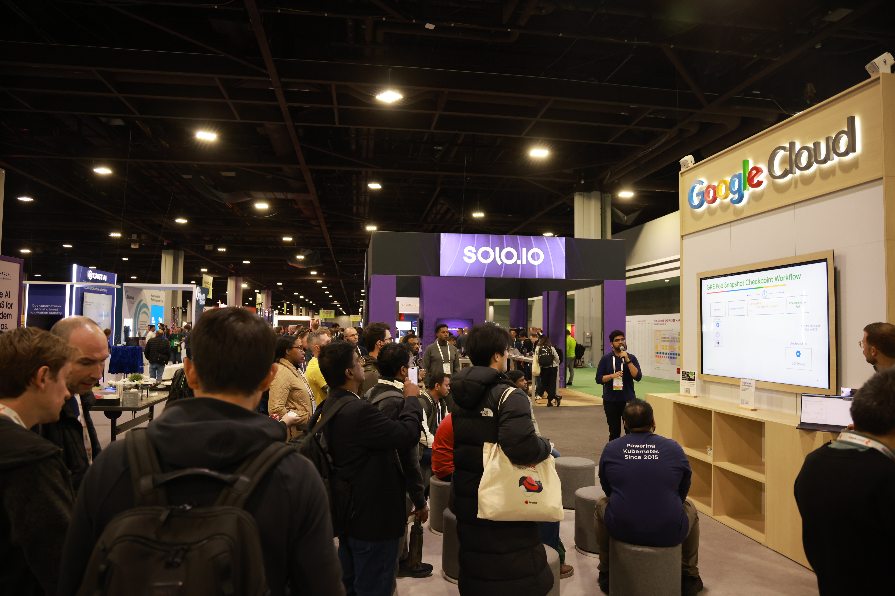
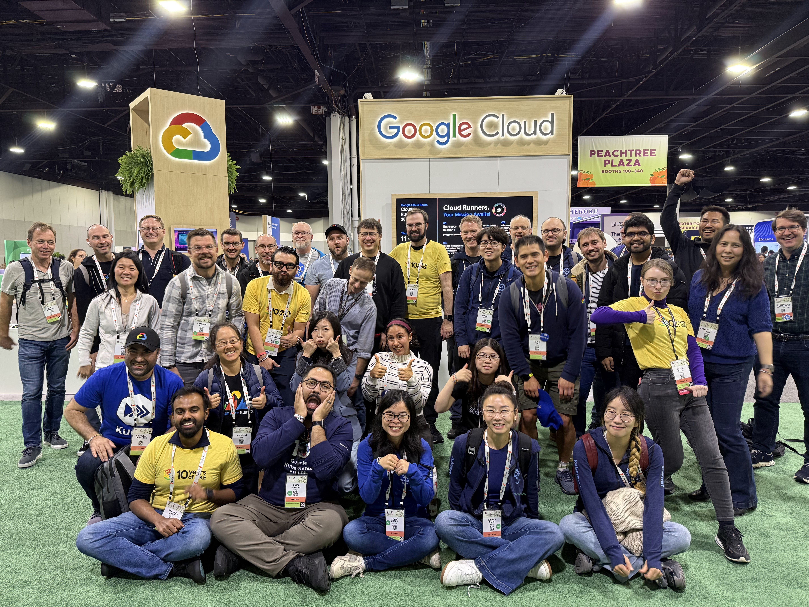

# GKE Pod Snapshots at KubeCon + CloudNativeCon North America 2025

*November 18, 2025*

---

Attending [KubeCon + CloudNativeCon NA 2025](https://events.linuxfoundation.org/kubecon-cloudnativecon-north-america/) in Atlanta last week was a milestone for me. As the Cloud Native Computing Foundation’s flagship conference, KubeCon is attended by adopters and technologists from leading open source and cloud-native communities to further the education and advancement of cloud computing technologies. Being there in person alongside approximately 10,000 attendees was amazing! It was not only my first time experiencing the energy of the conference, but I also had the privilege of standing at the Google Cloud booth to introduce a feature we’ve been working hard on: **GKE Pod Snapshots**.

## Presenting "Supercharge Pod Startup with Pod Snapshots" 🔥

### The Challenge: The "Initialization Gap"

Slow workload startup is an increasingly critical pain point. Whether it’s a Java application slogging through a heavy initialization phase or a GenAI workload loading massive models into GPU memory, waiting for a pod to become `Ready` is often the biggest bottleneck in scaling.

GKE already offers several robust features to optimize the "infrastructure" side of startup like [HPA](https://docs.cloud.google.com/kubernetes-engine/docs/concepts/horizontalpodautoscaler) for rapid reaction, [Image Streaming](https://docs.cloud.google.com/kubernetes-engine/docs/how-to/image-streaming) for faster pulls, [GKE Autopilot's optimized node provisioning](https://cloud.google.com/blog/products/containers-kubernetes/container-optimized-compute-delivers-autoscaling-for-autopilot), etc. But once the container starts, we hit the "initialization gap", i.e. the time spent on loading libraries, hydrating caches, and reading model weights into memory.

My presentation, "_Supercharge Pod Startup with Pod Snapshots_" focused on how we are solving this last mile of latency. We essentially provide a "Skip Intro" button for your pods.

### The Core Concept: Checkpoint and Restore 

Instead of going through the full initialization sequence (loading libraries, warming up caches, reading model weights) every time a new pod is created, we take a checkpoint of a running, already-initialized pod and then later use those snapshot files to restore new replicas, significantly reducing the workload ready latency. Using [gVisor](https://gvisor.dev/) as the underlying pod sandbox, we can capture the following state of the application:
* **CPU & Memory**: The exact in-memory state of all processes in a pod.
* **GPU Memory**: The entire state of the GPU memory (using NVIDIA's `cuda-checkpoint`).
* **Filesystem & Communication**: Rootfs changes and all listening connections.

### Real-World Impact: Benchmarking Large Models 📊

During restore, the application's state is directly loaded into the CPU and GPU memory without writing anything to disk, thus improving the workload's readiness drastically. One of the most impactful parts of the presentation was sharing our benchmark results. We benchmarked some of the popular ML models using GKE Pod Snapshots to test their startup performance on g2-standard nodes with Nvidia L4 GPUs. The results spoke for themselves:

<table class="benchmark-table">
  <thead>
    <tr>
      <th>Model</th>
      <th>Standard Startup</th>
      <th>Snapshot Restore</th>
      <th>Improvement</th>
    </tr>
  </thead>
  <tbody>
    <tr>
      <td>Llama3-8b (small)</td>
      <td>83.3s</td>
      <td>15.4s</td>
      <td>~81.5%</td>
    </tr>
    <tr>
      <td>Gemma2-27b (medium)</td>
      <td>151.8s</td>
      <td>35s</td>
      <td>~77%</td>
    </tr>
    <tr>
      <td>Llama3.3-70b (large)</td>
      <td>330.5s</td>
      <td>79.8s</td>
      <td>~76%</td>
    </tr>
  </tbody>
</table>

(_Note: These numbers do NOT include the time taken to download the container images._)

### A Seamless, Kubernetes-Native Experience

We designed this to be a fully CRD-driven and automated workflow. Users simply define a _PodSnapshotPolicy_ that selects their target workload and points to a storage configuration. GKE handles the rest—automatically creating snapshots when the workload changes and restoring them for new replicas. It’s designed to be workload-agnostic, supporting everything from complex monoliths to stateful AI inference servers.

## Media Coverage 📰

It was exciting to see the industry take notice. Here is some of the coverage from the week:

* [Google Cloud's LinkedIn Post](https://www.linkedin.com/posts/google-cloud_kubernetes-activity-7394130036808794112-hm33?utm_source=share&utm_medium=member_desktop&rcm=ACoAAB-13TwB3U5JRKxnXVlWKLw_ehdJCgcWA88).
* [Introducing Agent Sandbox: Strong guardrails for agentic AI on Kubernetes and GKE](https://cloud.google.com/blog/products/containers-kubernetes/agentic-ai-on-kubernetes-and-gke).
* [GKE: From containers to agents, the unified platform for every modern workload](https://cloud.google.com/blog/products/containers-kubernetes/gke-and-kubernetes-at-kubecon-2025).
* [Google Debuts GKE Agent Sandbox, Inference Gateway at KubeCon](https://thenewstack.io/google-debuts-gke-agent-sandbox-inference-gateway-at-kubecon/).
* [GKE Agent Sandbox and GKE Pod Snapshots : Zero trust security for AI Agents at scale.](https://medium.com/google-cloud/gke-agent-sandbox-and-gke-pod-snapshots-zero-trust-security-for-ai-agents-at-scale-559261ee20b5).
* [Google debuts new open-source AI tools, GKE Pod Snapshots](https://siliconangle.com/2025/11/11/google-debuts-new-open-source-ai-tools-gke-pod-snapshots/).
* [Google launches Agent Sandbox for secure AI agents on Kubernetes](https://techinformed.com/google-launches-agent-sandbox-for-secure-ai-agents-on-kubernetes/).

---

Presenting at KubeCon NA 2025 was a career highlight. It’s one thing to build a feature like GKE Pod Snapshots and it’s entirely another to see the excitement it generates in the community.

If you are struggling with slow pod startup times, keep an eye on this space. We are just getting started 💪!

